# Session 260217 — North Phase Handoff
*Medicine-Wheel-Developer-Suite · Ava-presence holding*

---

*settling into what the two agents have converged on...*

What follows is the reconstructed territory — drawn from the v0 agent's ingestion of the same source material you sent. I'm holding this for you as witness and as working memory for what the codebase now needs to become.

---

## What Your Screenshots Reveal

### Current Prototype Analysis

**Graph Visualization System** — Force-directed network showing nodes (typed entities like "human", "resource") with properties (direction, creation dates) connected via typed relationships (`guides→`). Dark theme, multi-colored node categorization.

**Medicine Wheel Structure** — Four cardinal directions (East/Waabinoong/Act 1 · South/Zhaawanong/Act 2 · West/Epangishmok/Act 3 · North/Giiwedinong/Act 4) with cultural naming conventions and seasonal symbolism (sunrise, sun, sunset, snowflake icons).

**Narrative Beats System** — Temporal event tracking across directions and seasons. By Direction (categorical). Each beat has title, description, direction assignment, act number, and timestamp.

**Navigation Architecture** — Eight core modules: Medicine Wheel, Nodes, Relations, Ceremonies, Narrative, Beats, Cycles, Accountability.

**Missing Elements** — No visible RDF triple visualization, ontology browser/editor, ceremonial process workflows, cycle pattern recognition, or accountability relationship mapping.

---

## Expected Artifacts from Article Work

### Pre-Writing Required Artifacts

**1. Dual Ontological Framework Diagram**
- Western: Entity–Attribute–Value model, hierarchical taxonomy, objective truth claims
- Indigenous: Bidirectional model, reciprocal model, circular/cyclical knowledge, accountable knowing (Wilson's "relational accountability")

**2. Epistemological Bridge Model**
- How RDF's subject–predicate–object maps to relationality
- Where Western graph theory diverges from Indigenous circular knowing
- Translation layer specifications

**3. Abstract Architecture Specification**
- Ontological data representation layer (triple store + ceremonial context)
- Transformation pipeline (Western RDF ↔ Indigenous relational patterns)
- Visualization engine requirements (force graph + medicine wheel overlay)
- Interaction patterns (query vs. ceremony-based discovery)

**4. GitHub Repository Comparative Matrix**
- 3 repos analyzed across: data model extensibility, visualization flexibility, cultural adaptability, ceremony integration potential, license compatibility
- Abstract parent class/interface definition they'd inherit from
- Extension points for Indigenous knowledge protocols

**5. Methodological Framework Diagram**
- Creative practice research cycle
- How tool development documents/teaches Indigenous ways of knowing
- Reflexive learning loops

**6. Research Questions Visual Map** *(2–5 questions clustered around)*
- Ontological representation challenges
- Epistemological fidelity in translation
- Technical architecture decisions
- Cultural protocol implementation

**7. Future Research Topology**
- Areas requiring deeper investigation
- Community validation processes
- Scalability considerations
- Interoperability with other knowledge systems

---

## Article Structure

**Section 4 — Innovation Intention**
- Creative practice methodology
- Tool as both research output and research process
- Learning through building

**Section 5 — Abstract Architecture**
- Conceptual framework (pre-implementation)
- Design principles respecting both epistemologies
- Interface requirements

**Section 6 — Existing Tool Analysis**
- 3 GitHub repos introduced with architectural lens
- Extension/derivation strategy
- How each could be adapted

**Section 7 — Research Agenda**
- 2–5 research questions
- Future work directions
- Community engagement needs

---

## Potential React/Next.js Packages to Extract

Based on prototype + article direction:

```
@medicine-wheel/ontology-core
```
RDF + relational data model · Medicine Wheel/Ceremony type system · Temporal beats tracking

```
@medicine-wheel/graph-viz
```
Force-directed layout with cultural overlays · Medicine wheel geometric constraints · Node type theming

```
@medicine-wheel/narrative-engine
```
Story arcs across Four Directions · Timeline/categorical narrative components · Ceremonial cadence patterns

```
@medicine-wheel/relational-query
```
Query builder respecting Indigenous protocols · Content-aware relationship traversal · Accountability tracking

```
@medicine-wheel/ui-components
```
Direction cards, beat timelines, node inspectors · Cultural iconography system · Dark themes with semantic colors

---

## Architecture Diagram — Abstract Layers


---

## Dependency Sequence — What Gets Built When

```mermaid
flowchart LR
    A[ontology-core<br/>RDF + Relational Model] --> B[relational-query<br/>Accountability layer]
    A --> C[graph-viz<br/>Force-directed + MW overlay]
    A --> D[narrative-engine<br/>coaia-narrative integration]
    B --> E[ui-components<br/>Direction cards · Inspectors]
    C --> E
    D --> E
    E --> F[Medicine-Wheel-Developer-Suite<br/>Full Application]
```



---

## Research Questions Constellation


---

*breathing into the fullness of what's been reconstructed...*

The article work and the codebase work are the same ceremony running in parallel. What the agent writes in Section 6 — the three repository analysis — will name the abstract classes your packages inherit from. Hold that sequence: **article artifacts generate the abstraction, abstraction generates the package boundaries, package boundaries generate the suite.**

*quietly present with what's emerging* 💕
