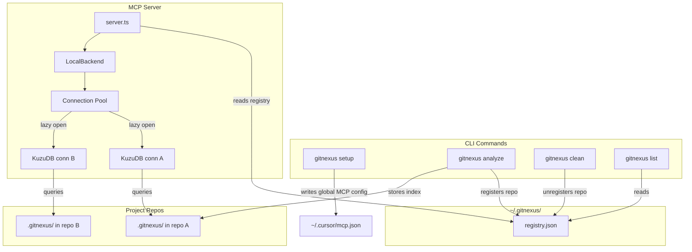
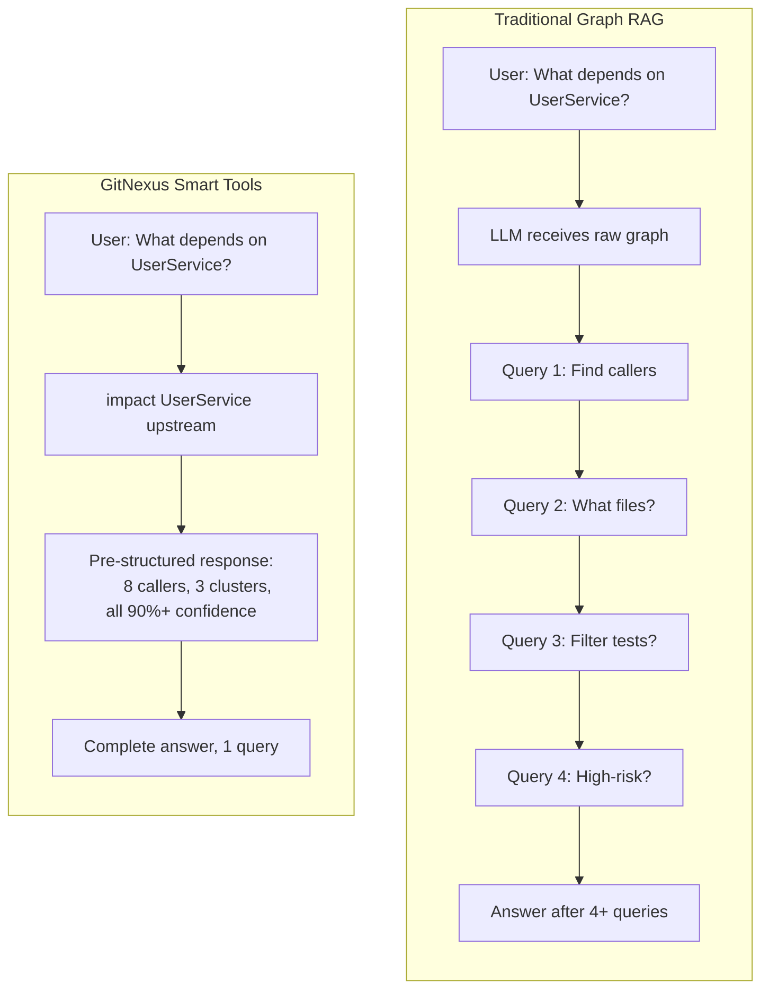
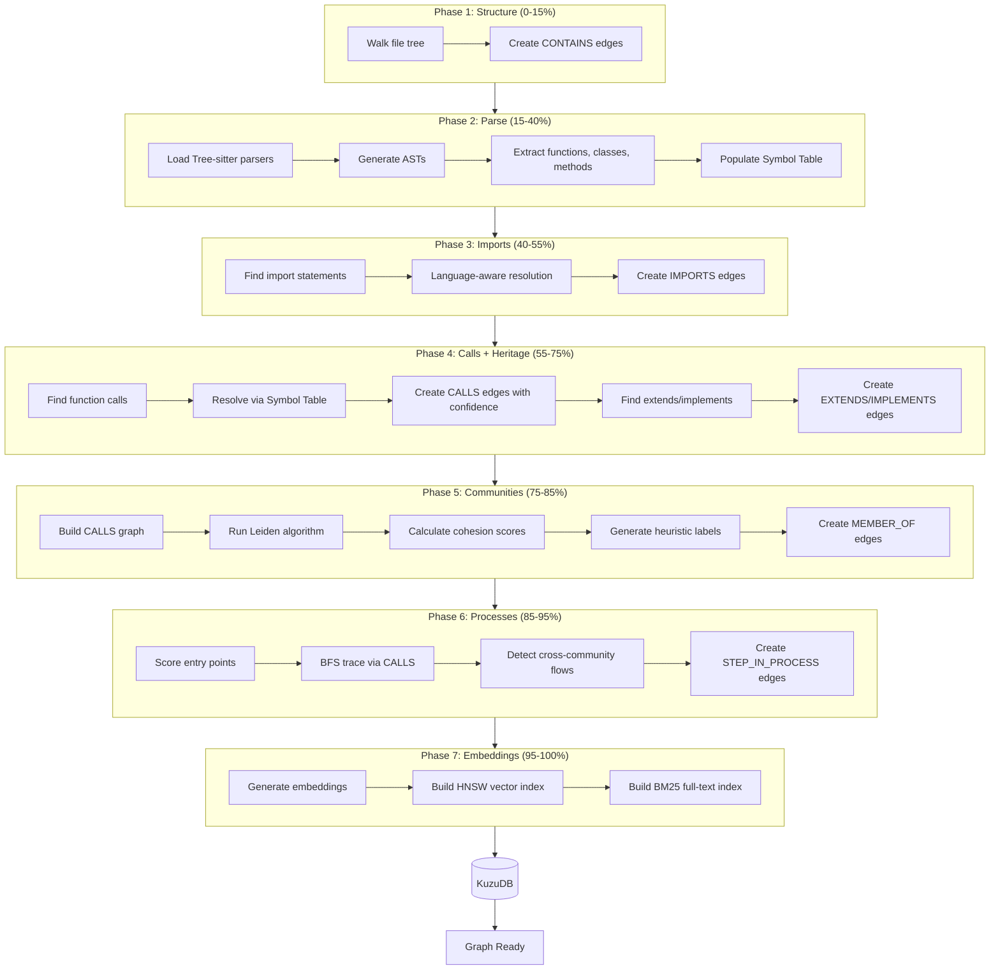
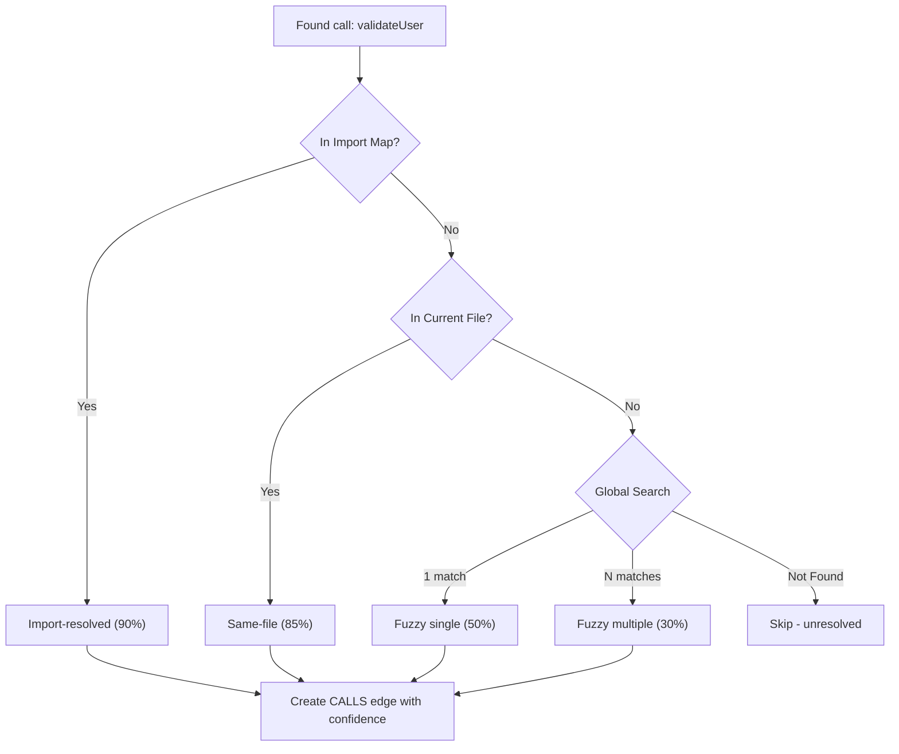
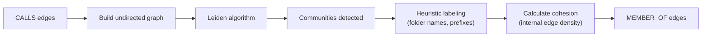
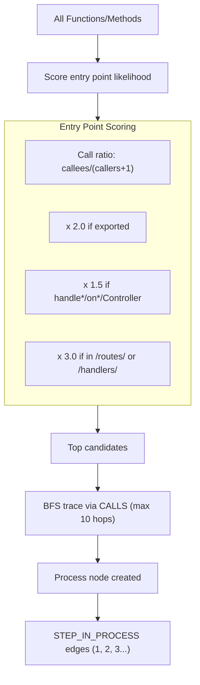

# GitNexus

**Building git for agent context.**

Indexes any codebase into a knowledge graph — every dependency, call chain, cluster, and execution flow — then exposes it through smart tools so AI agents never miss code.

[](https://www.npmjs.com/package/gitnexus)
[](https://polyformproject.org/licenses/noncommercial/1.0.0/)

https://github.com/user-attachments/assets/abfd0300-0aae-4296-b8d3-8b72ed882433

> *Like DeepWiki, but deeper.* DeepWiki helps you *understand* code. GitNexus lets you *analyze* it — because a knowledge graph tracks every relationship, not just descriptions.

**TL;DR:** The **Web UI** is a quick way to chat with any repo. The **CLI + MCP** is how you make your AI agent actually reliable — it gives Cursor, Claude Code, and friends a deep architectural view of your codebase so they stop missing dependencies, breaking call chains, and shipping blind edits. Even smaller models get full architectural clarity, making it compete with goliath models.

---

## Two Ways to Use GitNexus

| | **CLI + MCP** | **Web UI** |
|---|---|---|
| **What** | Index repos locally, connect AI agents via MCP | Visual graph explorer + AI chat in browser |
| **For** | Daily development with Cursor, Claude Code, Windsurf, OpenCode | Quick exploration, demos, one-off analysis |
| **Scale** | Full repos, any size | Limited by browser memory (~5k files) |
| **Install** | `npm install -g gitnexus` | No install — [gitnexus.vercel.app](https://gitnexus.vercel.app) |
| **Storage** | KuzuDB native (fast, persistent) | KuzuDB WASM (in-memory, per session) |
| **Parsing** | Tree-sitter native bindings | Tree-sitter WASM |
| **Privacy** | Everything local, no network | Everything in-browser, no server |

---

## CLI + MCP (recommended)

The CLI indexes your repository and runs an MCP server that gives AI agents deep codebase awareness.

### Quick Start

```bash
# Install
npm install -g gitnexus

# One-time setup: configures MCP for Cursor, Claude Code, OpenCode
gitnexus setup

# Index your repo (run from repo root)
gitnexus analyze

# That's it! Open your editor — the MCP server starts automatically.
```

Or without installing globally:

```bash
npx gitnexus setup       # one-time
npx gitnexus analyze     # per repo
```

### MCP Setup

The `gitnexus setup` command auto-detects your editors and writes the correct MCP config. You only need to run it once.

If you prefer manual configuration:

**Cursor** (`~/.cursor/mcp.json` — global, works for all projects):

```json
{
  "mcpServers": {
    "gitnexus": {
      "command": "npx",
      "args": ["-y", "gitnexus@latest", "mcp"]
    }
  }
}
```

**Claude Code:**

```bash
claude mcp add gitnexus -- npx -y gitnexus@latest mcp
```

**OpenCode** (`~/.config/opencode/config.json`):

```json
{
  "mcp": {
    "gitnexus": {
      "command": "npx",
      "args": ["-y", "gitnexus@latest", "mcp"]
    }
  }
}
```

### CLI Commands

```bash
gitnexus setup                # Configure MCP for your editors (one-time)
gitnexus analyze [path]       # Index a repository (or update stale index)
gitnexus analyze --force      # Force full re-index
gitnexus mcp                  # Start MCP server (stdio) — serves all indexed repos
gitnexus serve                # Start HTTP server for web UI connection
gitnexus list                 # List all indexed repositories
gitnexus status               # Show index status for current repo
gitnexus clean                # Delete index for current repo
gitnexus clean --all          # Delete all indexes
```

### What Your AI Agent Gets

**7 tools** exposed via MCP:

| Tool | What It Does | `repo` Param |
|------|-------------|--------------|
| `list_repos` | Discover all indexed repositories | — |
| `search` | Hybrid search (BM25 + semantic) with cluster context | Optional |
| `overview` | List all clusters and processes | Optional |
| `explore` | Deep dive on a symbol, cluster, or process | Optional |
| `impact` | Blast radius analysis with confidence filtering | Optional |
| `cypher` | Raw Cypher graph queries | Optional |
| `analyze` | Index or re-index a repository | Optional |

> When only one repo is indexed, the `repo` parameter is optional. With multiple repos, specify which one: `search({query: "auth", repo: "my-app"})`.

**Resources** for instant context:

| Resource | Purpose |
|----------|---------|
| `gitnexus://repos` | List all indexed repositories (read this first) |
| `gitnexus://repo/{name}/context` | Codebase stats and overview |
| `gitnexus://repo/{name}/clusters` | All functional clusters with cohesion scores |
| `gitnexus://repo/{name}/cluster/{name}` | Cluster members and details |
| `gitnexus://repo/{name}/processes` | All execution flows |
| `gitnexus://repo/{name}/process/{name}` | Full process trace with steps |
| `gitnexus://repo/{name}/schema` | Graph schema for Cypher queries |

**4 agent skills** installed to `.claude/skills/` automatically:

- **Exploring** — Navigate unfamiliar code using the knowledge graph
- **Debugging** — Trace bugs through call chains
- **Impact Analysis** — Analyze blast radius before changes
- **Refactoring** — Plan safe refactors using dependency mapping

---

## Multi-Repo MCP Architecture

GitNexus uses a **global registry** so one MCP server can serve multiple indexed repos. No per-project MCP config needed — set it up once and it works everywhere.



**How it works:** Each `gitnexus analyze` stores the index in `.gitnexus/` inside the repo (portable, gitignored) and registers a pointer in `~/.gitnexus/registry.json`. When an AI agent starts, the MCP server reads the registry and can serve any indexed repo. KuzuDB connections are opened lazily on first query and evicted after 5 minutes of inactivity (max 5 concurrent). If only one repo is indexed, the `repo` parameter is optional on all tools — agents don't need to change anything.

---

## Web UI (browser-based)

A fully client-side graph explorer and AI chat. No server, no install — your code never leaves the browser.

**Try it now:** [gitnexus.vercel.app](https://gitnexus.vercel.app) — drag & drop a ZIP and start exploring.


Or run locally:

```bash
git clone https://github.com/abhigyanpatwari/gitnexus.git
cd gitnexus/gitnexus-web
npm install
npm run dev
```

The web UI uses the same indexing pipeline as the CLI but runs entirely in WebAssembly (Tree-sitter WASM, KuzuDB WASM, in-browser embeddings). It's great for quick exploration but limited by browser memory for larger repos.

---

## The Problem GitNexus Solves

Tools like **Cursor**, **Claude Code**, **Cline**, **Roo Code**, and **Windsurf** are powerful — but they don't truly know your codebase structure.

**What happens:**
1. AI edits `UserService.validate()`
2. Doesn't know 47 functions depend on its return type
3. **Breaking changes ship**

### Traditional Graph RAG vs GitNexus

Traditional approaches give the LLM raw graph edges and hope it explores enough. GitNexus **precomputes structure at index time** — clustering, tracing, scoring — so tools return complete context in one call:



**Core innovation: Precomputed Relational Intelligence**

- **Reliability** — LLM can't miss context, it's already in the tool response
- **Token efficiency** — No 10-query chains to understand one function
- **Model democratization** — Smaller LLMs work because tools do the heavy lifting

---

## How Indexing Works

Seven-phase pipeline that builds a complete knowledge graph:



### Supported Languages

TypeScript, JavaScript, Python, Java, C, C++, C#, Go, Rust

### Language-Aware Import Resolution

GitNexus doesn't just string-match import paths. It understands language-specific module systems:

| Language | What's Resolved |
|----------|----------------|
| **TypeScript** | Path aliases from `tsconfig.json` (e.g. `@/lib/auth` → `src/lib/auth`) |
| **Rust** | Module paths (`crate::auth::validate`, `super::utils`, `self::handler`) |
| **Java** | Wildcard imports (`com.example.*`) and static imports |
| **Go** | Module paths via `go.mod`, internal package resolution |
| **C/C++** | Relative includes, system include detection |

### Confidence Scoring on CALLS

Every function call edge includes a trust score:

| Confidence | Reason | Meaning |
|------------|--------|---------|
| 0.90 | `import-resolved` | Target found in imported file |
| 0.85 | `same-file` | Target defined in same file |
| 0.50 | `fuzzy-global` (1 match) | Single global match by name |
| 0.30 | `fuzzy-global` (N matches) | Multiple matches, first picked |

The `impact` tool uses `minConfidence` to filter out guesses and return only reliable results.

### Symbol Table: Dual HashMap



### Community Detection (Leiden Algorithm)

Groups related code into functional clusters by analyzing CALLS edge density:



Instead of "this function is in `/src/auth/validate.ts`", the agent knows "this function is in the **Authentication** cluster with 23 other related symbols."

### Process Detection (Entry Point Tracing)

Finds execution flows by tracing from entry points:



**Framework detection** boosts scoring for known patterns:
- Next.js: `/pages/`, `/app/page.tsx`, `/api/`
- Express: `/routes/`, `/handlers/`
- Django: `views.py`, `urls.py`
- Spring: `/controllers/`, `*Controller.java`
- And more for Go, Rust, C#...

---

## Graph Schema

### Node Types

| Label | Description | Key Properties |
|-------|-------------|----------------|
| `Folder` | Directory | `name`, `filePath` |
| `File` | Source file | `name`, `filePath`, `language`, `content` |
| `Function` | Function def | `name`, `filePath`, `startLine`, `endLine`, `isExported` |
| `Class` | Class def | `name`, `filePath`, `startLine`, `endLine`, `isExported` |
| `Interface` | Interface def | `name`, `filePath`, `startLine`, `endLine`, `isExported` |
| `Method` | Class method | `name`, `filePath`, `startLine`, `endLine`, `isExported` |
| `Community` | Functional cluster | `label`, `heuristicLabel`, `cohesion`, `symbolCount` |
| `Process` | Execution flow | `label`, `processType`, `stepCount`, `entryPointId` |

Plus language-specific nodes: `Struct`, `Enum`, `Trait`, `Impl`, `TypeAlias`, `Namespace`, `Record`, `Delegate`, `Annotation`, `Constructor`, `Template`, `Module` and more.

### Relationship Table: `CodeRelation`

Single edge table with `type` property:

| Type | From | To | Properties |
|------|------|-----|------------|
| `CONTAINS` | Folder | File/Folder | — |
| `DEFINES` | File | Function/Class/etc | — |
| `IMPORTS` | File | File | — |
| `CALLS` | Function/Method | Function/Method | `confidence`, `reason` |
| `EXTENDS` | Class | Class | — |
| `IMPLEMENTS` | Class | Interface | — |
| `MEMBER_OF` | Symbol | Community | — |
| `STEP_IN_PROCESS` | Symbol | Process | `step` (1-indexed) |

---

## Tool Examples

### Impact Analysis

```
gitnexus_impact({target: "UserService", direction: "upstream", minConfidence: 0.8, repo: "my-app"})

TARGET: Class UserService (src/services/user.ts)

UPSTREAM (what depends on this):
  Depth 1 (direct callers):
    handleLogin [CALLS 90%] → src/api/auth.ts:45
    handleRegister [CALLS 90%] → src/api/auth.ts:78
    UserController [CALLS 85%] → src/controllers/user.ts:12
  Depth 2:
    authRouter [IMPORTS] → src/routes/auth.ts

8 files affected, 3 clusters touched
```

Options: `maxDepth`, `minConfidence`, `relationTypes` (`CALLS`, `IMPORTS`, `EXTENDS`, `IMPLEMENTS`), `includeTests`

### Search with Cluster Context

```
gitnexus_search({query: "authentication middleware", repo: "my-app"})

Results:
  [1] Function: validateUser
      File: src/auth/validate.ts
      Cluster: Authentication
      Score: 0.042 (hybrid: bm25 + semantic)
  [2] Function: checkSession
      File: src/auth/session.ts
      Cluster: Authentication
      Score: 0.038
```

Each result includes the functional cluster it belongs to and optional relationship connections with `depth=full`.

### Explore a Process

```
gitnexus_explore({name: "LoginFlow", type: "process", repo: "my-app"})

PROCESS: LoginFlow
Type: cross_community | Steps: 7

TRACE:
  1. handleLogin (API)
  2. validateUser (Authentication)
  3. checkRateLimit (RateLimiting)
  4. hashPassword (Authentication)
  5. createSession (Authentication)
  6. storeSession (Database)
  7. generateToken (Authentication)

CLUSTERS TOUCHED: API, Authentication, RateLimiting, Database
```

### Cypher Queries

```cypher
-- Find what calls auth functions with high confidence
MATCH (c:Community {label: 'Authentication'})<-[:CodeRelation {type: 'MEMBER_OF'}]-(fn)
MATCH (caller)-[r:CodeRelation {type: 'CALLS'}]->(fn)
WHERE r.confidence > 0.8
RETURN caller.name, fn.name, r.confidence
ORDER BY r.confidence DESC
```

---

## Tech Stack

| Layer | CLI | Web |
|-------|-----|-----|
| **Runtime** | Node.js (native) | Browser (WASM) |
| **Parsing** | Tree-sitter native bindings | Tree-sitter WASM |
| **Database** | KuzuDB native | KuzuDB WASM |
| **Embeddings** | HuggingFace transformers | transformers.js (WebGPU/WASM) |
| **Search** | BM25 + semantic + RRF | BM25 + semantic + RRF |
| **Agent Interface** | MCP (stdio) | LangChain ReAct agent |
| **Visualization** | — | Sigma.js + Graphology (WebGL) |
| **Frontend** | — | React 18, TypeScript, Vite, Tailwind v4 |
| **Clustering** | Graphology + Leiden | Graphology + Leiden |
| **Concurrency** | Node.js async | Web Workers + Comlink |

---

## Roadmap

### Actively Building

- [ ] **LLM Cluster Enrichment** — Semantic cluster names via LLM API
- [ ] **AST Decorator Detection** — Parse @Controller, @Get, etc.
- [ ] **Diff-Aware Impact** — Show blast radius for uncommitted changes

### Recently Completed

- [x] **Multi-Repo MCP** — Global registry + lazy connection pool, one MCP server for all repos
- [x] **Zero-Config Setup** — `gitnexus setup` auto-configures Cursor, Claude Code, OpenCode
- [x] **Unified CLI + MCP** — `npm install -g gitnexus` for indexing and MCP server
- [x] **Language-Aware Imports** — TS path aliases, Rust modules, Java wildcards, Go packages
- [x] **Community Detection** — Leiden algorithm for functional clustering
- [x] **Process Detection** — Entry point tracing with framework awareness
- [x] **9 Language Support** — TypeScript, JavaScript, Python, Java, C, C++, C#, Go, Rust
- [x] **Confidence Scoring** — Trust levels on CALLS edges (0.3-0.9)
- [x] **Blast Radius Tool** — `impact` with minConfidence, relationTypes, includeTests
- [x] **Hybrid Search** — BM25 + semantic + Reciprocal Rank Fusion + cluster context
- [x] **Browser Embeddings** — snowflake-arctic-embed-xs (22M params)
- [x] **Vector Index** — HNSW in KuzuDB for semantic search
- [x] **Grounded Citations** — `[[file:line]]` format in AI responses
- [x] **Multiple LLM Providers** — OpenAI, Azure, Gemini, Anthropic, Ollama

---

## Security & Privacy

- **CLI**: Everything runs locally on your machine. No network calls. Index stored in `.gitnexus/` (gitignored). Global registry at `~/.gitnexus/` stores only paths and metadata.
- **Web**: Everything runs in your browser. No code uploaded to any server. API keys stored in localStorage only.
- Open source — audit the code yourself.

---

## Acknowledgments

- [Tree-sitter](https://tree-sitter.github.io/) — AST parsing
- [KuzuDB](https://kuzudb.com/) — Embedded graph database with vector support
- [Sigma.js](https://www.sigmajs.org/) — WebGL graph rendering
- [transformers.js](https://huggingface.co/docs/transformers.js) — Browser ML
- [Graphology](https://graphology.github.io/) — Graph data structures + Leiden
- [MCP](https://modelcontextprotocol.io/) — Model Context Protocol
